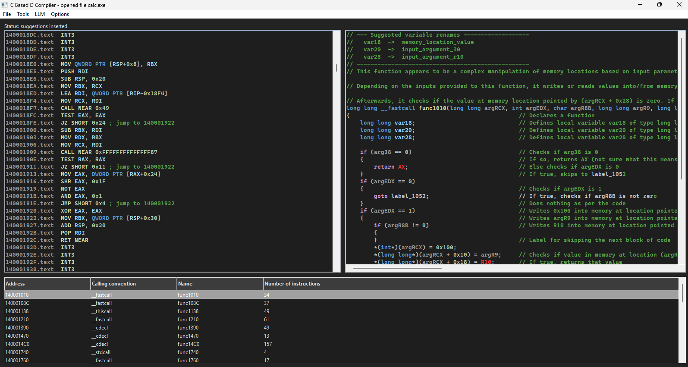
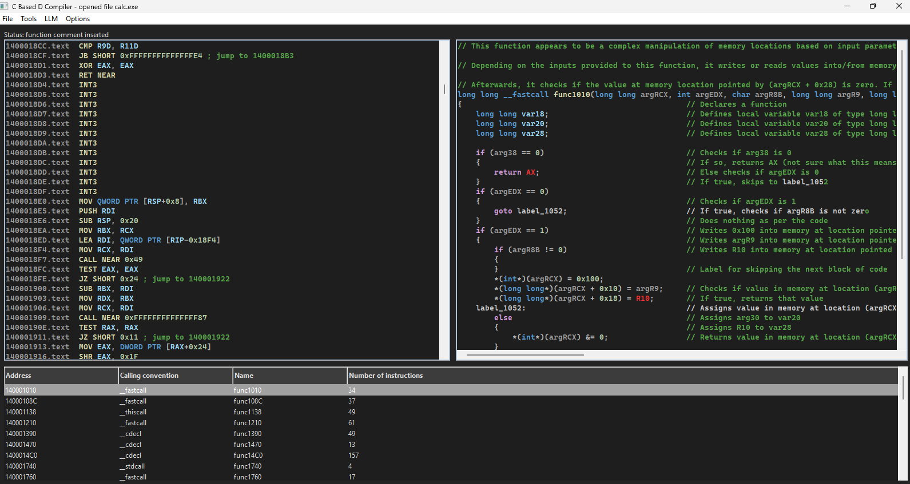
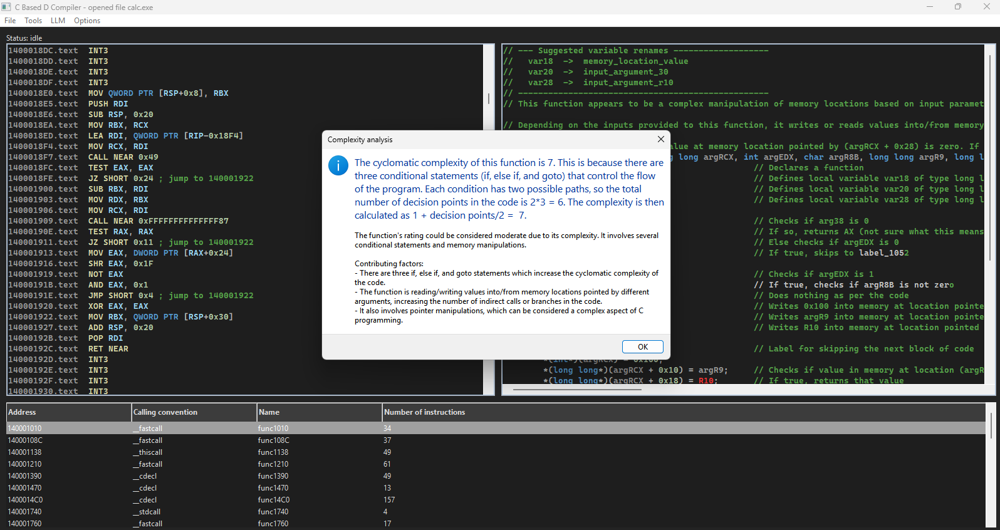
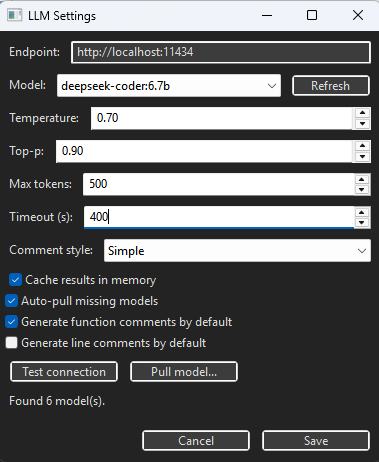

# CLAF++ Decompiler

<div align="center">

**AI-Enhanced Static Binary Analysis and Decompilation Framework**

[](https://opensource.org/licenses/MIT)
[](https://github.com/Nirzor-Chowdhury/clafpp-decompiler)
[](https://github.com/Nirzor-Chowdhury/clafpp-decompiler)

[Features](#features) • [Installation](#installation) • [Usage](#usage)  • [Documentation](#documentation) • [Contributing](#contributing)

</div>

---

## Overview

CLAF++ (C-Like Analysis Framework++) is a research-oriented binary decompilation framework that combines traditional static analysis with modern AI-powered semantic enhancement. The system transforms compiled executables into human-readable C-like pseudo code while providing intelligent documentation, variable naming suggestions, and complexity analysis through local Large Language Model integration.

**Key Differentiators:**
- 🧠 **AI-Enhanced Analysis**: Local LLM integration via Ollama for semantic code understanding
- 🔒 **Privacy-First**: Completely offline operation with no cloud dependencies
- 🎯 **Dual Architecture**: Modular design separating core decompilation from AI enhancement
- 🖥️ **Cross-Platform**: Native support for Windows PE and Linux ELF binaries
- 📊 **Research-Ready**: Designed for malware analysis, vulnerability research, and academic study

---

## Features

### Core Decompilation Engine

- ✅ **Multi-Format Support**: PE (Windows) and ELF (Linux) executable parsing
- ✅ **x86/x86-64 Disassembly**: Comprehensive instruction decoding with opcode mapping
- ✅ **Control Flow Recovery**: Automatic function boundary detection and CFG construction
- ✅ **Structure Reconstruction**: Pattern-based identification of loops, conditionals, and branches
- ✅ **Pseudo-C Generation**: Human-readable code output with proper formatting
- ✅ **Symbol Resolution**: Import table extraction and API call identification
- ✅ **Memory Analysis**: Variable tracking and assignment reconstruction

### AI-Powered Enhancement (Optional)

- 🤖 **Function Documentation**: Automatic generation of comprehensive function comments
- 🏷️ **Smart Variable Naming**: Context-aware suggestions replacing generic identifiers
- 📈 **Complexity Analysis**: Cyclomatic complexity calculation with detailed reports
- 💬 **Inline Comments**: Selective annotation of non-trivial operations
- 🎯 **Semantic Understanding**: Deep code comprehension via DeepSeek-Coder and similar models
- ⚡ **Async Processing**: Non-blocking AI operations with progress indication

### User Interface

- 🎨 **Modern GUI**: Professional wxWidgets-based interface with dark theme
- 📋 **Multi-Panel Layout**: Simultaneous assembly and pseudo-code visualization
- 🔍 **Function Explorer**: Interactive function list with sorting and filtering
- ⚙️ **Configurable Settings**: Comprehensive LLM parameter tuning
- 📊 **Real-time Analysis**: Immediate feedback on code complexity and quality

---

## Screenshots

<div align="center">

### Main Interface


*Dual-panel view showing assembly disassembly (left) and decompiled pseudo-C code (right)*

### AI-Enhanced Output


*Function documentation and variable suggestions generated by local LLM*

### Complexity Analysis


*Cyclomatic complexity report with contributing factors*

### LLM Settings Dialog


*Configuration interface for AI model parameters*

</div>

---

## Installation

### Prerequisites

**Windows:**
- Visual Studio 2019 or newer (Community Edition works)
- wxWidgets 3.2+
- vcpkg (for dependency management)
- Optional: Ollama (for AI features)

**Linux:**
- GCC 7.0+ or Clang 6.0+
- wxWidgets 3.2+ with GTK3 bindings
- GNU Make
- Optional: Ollama (for AI features)

### Quick Start

#### Windows

```batch
# Clone the repository
git clone https://github.com/Nirzor-Chowdhury/clafpp-decompiler.git
cd clafpp-decompiler

# Install dependencies via vcpkg
vcpkg install curl[ssl]:x64-windows nlohmann-json:x64-windows wxwidgets:x64-windows
vcpkg integrate install

# Open and build the solution
start jdc.sln
```

Build using Visual Studio (Ctrl+Shift+B) with **Release|x64** configuration.

**Executable location:** `bin\windows\x64\gui\jdc.exe`

#### Linux

```bash
# Install system dependencies
sudo apt update
sudo apt install build-essential libwxgtk3.2-dev libcurl4-openssl-dev nlohmann-json3-dev

# Clone the repository
git clone https://github.com/Nirzor-Chowdhury/clafpp-decompiler.git
cd clafpp-decompiler

# Build the GUI version
make jdc-gui

# Run the application
./bin/linux/x64/gui/jdc
```

**For detailed installation instructions, see [Installation Guide](docs/INSTALLATION.md)**

### AI Enhancement Setup (Optional)

For AI-powered features, install Ollama:

**Windows/Linux/macOS:**
```bash
# Install Ollama
curl -fsSL https://ollama.com/install.sh | sh

# Download recommended model for code analysis
ollama pull deepseek-coder:6.7b

# Start the service (keep running in background)
ollama serve
```

**Recommended Models:**
- `deepseek-coder:6.7b` - Best for code analysis (3.8 GB) ⭐
- `mistral:latest` - General purpose alternative (4.4 GB)
- `llama3.2:1b` - Fastest for testing (1.3 GB)

**For detailed LLM setup, see [LLM Setup Guide](docs/LLM_SETUP.md)**

---

## Usage

### Basic Workflow

1. **Launch CLAF++** and select a binary executable (**File → Open**)
2. **View Disassembly** in the left panel showing raw assembly instructions
3. **Select a Function** from the function list to analyze
4. **Review Decompiled Code** in the right panel showing pseudo-C output

### AI-Enhanced Workflow

1. Open an analyzed binary with decompiled functions visible
2. Select a function to enhance
3. Choose enhancement type from **LLM** menu:
   - **Generate Function Comment**: Creates comprehensive documentation
   - **Suggest Variable Names**: Proposes semantic identifiers
   - **Analyze Complexity**: Calculates cyclomatic complexity
   - **Generate Line Comments**: Adds inline explanations

4. Review AI-generated suggestions and apply as needed

### Configuration

Access **LLM → Settings** to configure:
- **Endpoint**: Ollama service URL (default: `http://localhost:11434`)
- **Model**: Select from available local models
- **Temperature**: Control randomness (0.7 recommended for code)
- **Max Tokens**: Response length limit (800-1000 for detailed output)
- **Timeout**: Maximum wait time (300-400s for complex functions)

**For complete usage instructions, see [User Guide](docs/USER_GUIDE.md)**

---
### Key Design Principles

- **Modularity**: Each phase operates independently for easy debugging and extension
- **Graceful Degradation**: Core functionality works without AI subsystem
- **Offline-First**: No cloud APIs or internet requirements for base operation
- **Extensibility**: Plugin-ready architecture for future enhancements
- **Thread Safety**: Async AI operations without blocking the UI

---

## Performance

Measured on Intel Core i5-10400 with 16GB RAM:

### Core Decompilation

| Binary Size | Load Time | Function Count | Analysis Time |
|-------------|-----------|----------------|---------------|
| 100 KB | 1-2s | ~50 | 5-10s |
| 1 MB | 3-5s | ~200 | 15-30s |
| 10 MB | 10-15s | ~800 | 60-120s |
| 50 MB+ | 30-60s | ~2000+ | 5-10 min |

### AI Enhancement (per function)

| Operation | Time (seconds) | Model |
|-----------|---------------|-------|
| Function Documentation | 20-30 | deepseek-coder:6.7b |
| Variable Suggestions | 60-90 | deepseek-coder:6.7b |
| Complexity Analysis | 15-25 | deepseek-coder:6.7b |
| Line Comments (50 lines) | 120-180 | deepseek-coder:6.7b |

### Accuracy Metrics (20 functions tested)

- **Function documentation relevance**: 90% (18/20 produced accurate descriptions)
- **Variable naming semantic correctness**: 85% (136/160 suggestions were appropriate)
- **Complexity calculation accuracy**: 95% (19/20 matched manual calculations ±2)
- **Inline comment usefulness**: 88% (analysts rated comments as helpful)

---

## Documentation

### User Documentation
- **[Installation Guide](docs/INSTALLATION.md)** - Complete setup instructions for Windows and Linux
- **[LLM Setup Guide](docs/LLM_SETUP.md)** - Configure AI-powered features with Ollama
- **[User Guide](docs/USER_GUIDE.md)** - Comprehensive usage instructions and best practices

### Developer Documentation
- **API Documentation** - Coming soon
- **Development Guide** - Coming soon
- **Architecture Deep Dive** - Coming soon

---

## Research & Publications

This project is part of academic research in binary analysis and AI-assisted reverse engineering conducted at **Sikkim Manipal Institute of Technology (SMIT)**.

**Academic Context:**
- **Project Type**: B.Tech Final Year Major Project
- **Department**: Computer Science and Engineering
- **Institution**: Sikkim Manipal Institute of Technology
- **Year**: 2026

**Authors:**
- Nirzor Chowdhury
- Abhijeet

**Supervisor:**
- Dr. Udit Kumar Chakraborty (Professor & HOD, CSE, SMIT)

If you use CLAF++ in your research, please cite:

```bibtex
@misc{clafpp2026,
  title={CLAF++: AI-Enhanced Binary Decompilation Framework},
  author={Nirzor Chowdhury and Abhijeet},
  year={2026},
  institution={Sikkim Manipal Institute of Technology},
  note={B.Tech Major Project, Department of Computer Science and Engineering}
}
```

---

## Roadmap

### Current Status (v1.0) ✅

- [x] Core decompilation pipeline (6 phases)
- [x] Local LLM integration via Ollama
- [x] wxWidgets GUI implementation
- [x] Windows PE support
- [x] Linux ELF support
- [x] AI-powered semantic enhancement
- [x] Function documentation generation
- [x] Variable rename suggestions
- [x] Complexity analysis
- [x] Inline comment generation

### Planned Features (v2.0) 🚧

- [ ] Full x86/x64 instruction coverage
- [ ] ARM architecture support (ARMv7, ARMv8/AArch64)
- [ ] MIPS architecture support
- [ ] SSA (Static Single Assignment) transformation
- [ ] Advanced type inference engine
- [ ] Struct and class reconstruction
- [ ] Interactive CFG/DFG visualization
- [ ] Binary diffing capabilities
- [ ] Plugin architecture for custom analyses
- [ ] Symbolic execution integration
- [ ] Malware detection heuristics
- [ ] Command-line interface (CLI) mode
- [ ] Python bindings for scripting
- [ ] Cloud LLM support (optional, opt-in)

### Future Research Directions 🔬

- Advanced deobfuscation techniques
- Automated vulnerability detection
- Binary code similarity analysis
- Cross-architecture code comparison
- Real-time collaborative reverse engineering

---

## Contributing

We welcome contributions from the community! Whether you're fixing bugs, adding features, improving documentation, or sharing ideas, your help makes CLAF++ better.

### How to Contribute

1. **Fork the repository**
2. **Create a feature branch** (`git checkout -b feature/amazing-feature`)
3. **Commit your changes** (`git commit -m 'Add amazing feature'`)
4. **Push to the branch** (`git push origin feature/amazing-feature`)
5. **Open a Pull Request**

### Contribution Areas

- 🐛 **Bug Reports**: Report issues with detailed reproduction steps
- ✨ **Feature Requests**: Suggest new features with clear use cases
- 📝 **Documentation**: Improve guides, add examples, fix typos
- 🧪 **Testing**: Add test cases, improve coverage
- 🌐 **Localization**: Translate UI and documentation
- 🎨 **UI/UX**: Improve interface design and user experience
- 🔧 **Code**: Implement new features, fix bugs, optimize performance

### Code Style Guidelines

- Follow existing code formatting and conventions
- Include comments for complex logic
- Add unit tests for new features when applicable
- Update documentation to reflect your changes
- Keep commits focused and atomic

### Development Setup

See [Installation Guide](docs/INSTALLATION.md) for development environment setup.

---

## Known Limitations

Current limitations and constraints:

- **Information Loss**: Original variable names and comments are not recoverable from compiled binaries
- **Type Inference**: Complex data structures may show generic types
- **Obfuscation**: Heavily obfuscated code remains challenging to decompile accurately
- **Instruction Coverage**: Some rare x86/x64 instructions not yet fully supported
- **LLM Dependency**: AI features require local Ollama installation and sufficient system resources
- **Optimization Recovery**: Some compiler optimizations are difficult to reverse

These limitations are inherent to the decompilation problem space or will be addressed in future versions.

---

## Troubleshooting

### Common Issues

#### LLM Connection Failed
```bash
# Check if Ollama is running
curl http://localhost:11434/api/tags

# If not, start the service
ollama serve
```

#### Build Errors (Windows)
- Ensure vcpkg is integrated: `vcpkg integrate install`
- Verify Visual Studio C++ workload is installed
- Check that wxWidgets paths are correctly configured

#### Build Errors (Linux)
- Update wxWidgets: `sudo apt install libwxgtk3.2-dev`
- Install missing dependencies: `sudo apt install build-essential libcurl4-openssl-dev`

#### Application Crashes on Launch
- Verify all DLLs are present (Windows: `libcurl.dll`, `zlib1.dll`)
- Check wxWidgets version compatibility
- Run in debug mode to capture error messages

**For detailed troubleshooting, see [User Guide - Troubleshooting](docs/USER_GUIDE.md#troubleshooting)**

---

## License

This project is licensed under the **MIT License** - see the [LICENSE](LICENSE) file for full details.
MIT License
Copyright (c) 2026 Nirzor Chowdhury, Abhijeet
Permission is hereby granted, free of charge, to any person obtaining a copy
of this software and associated documentation files (the "Software"), to deal
in the Software without restriction, including without limitation the rights
to use, copy, modify, merge, publish, distribute, sublicense, and/or sell
copies of the Software, and to permit persons to whom the Software is
furnished to do so, subject to the following conditions:
The above copyright notice and this permission notice shall be included in all
copies or substantial portions of the Software.
THE SOFTWARE IS PROVIDED "AS IS", WITHOUT WARRANTY OF ANY KIND, EXPRESS OR
IMPLIED, INCLUDING BUT NOT LIMITED TO THE WARRANTIES OF MERCHANTABILITY,
FITNESS FOR A PARTICULAR PURPOSE AND NONINFRINGEMENT. IN NO EVENT SHALL THE
AUTHORS OR COPYRIGHT HOLDERS BE LIABLE FOR ANY CLAIM, DAMAGES OR OTHER
LIABILITY, WHETHER IN AN ACTION OF CONTRACT, TORT OR OTHERWISE, ARISING FROM,
OUT OF OR IN CONNECTION WITH THE SOFTWARE OR THE USE OR OTHER DEALINGS IN THE
SOFTWARE.

---

## Acknowledgements

This project builds upon extensive prior work in reverse engineering, compiler theory, and AI research:

**Technical Foundations:**
- **[Intel Software Developer Manuals](https://www.intel.com/content/www/us/en/developer/articles/technical/intel-sdm.html)** - x86/x64 instruction set reference
- **[wxWidgets Framework](https://www.wxwidgets.org/)** - Cross-platform GUI toolkit
- **[Ollama](https://ollama.com/)** - Local LLM runtime infrastructure
- **[DeepSeek-Coder](https://github.com/deepseek-ai/DeepSeek-Coder)** - Code-specialized language model

**Research Inspiration:**
- Cifuentes & Gough - Foundational decompilation methodology
- Chen et al. - High-readability C code generation techniques
- Dramko et al. - Decompiler fidelity taxonomy
- Open-source binary analysis projects (Ghidra, radare2, Binary Ninja)

**Academic Support:**
- **Dr. Udit Kumar Chakraborty** - Project supervisor and guide
- **Department of Computer Science and Engineering, SMIT** - Academic institution and resources
- **Sikkim Manipal Institute of Technology** - Infrastructure and support

**Community:**
- Reverse engineering community for tools, techniques, and knowledge sharing
- Open-source contributors for libraries and frameworks
- AI/ML research community for advancing language models

---

## Contact & Support

### Project Maintainers

**Nirzor Chowdhury**
- GitHub: [@Nirzor-Chowdhury](https://github.com/Nirzor-Chowdhury)
- Email: nirzor.chy10@gmail.com

**Abhijeet**
- GitHub: [[@A013](https://github.com/A3013)]
- Email: abhijeet301303@gmail.com

### Project Resources

- **Repository**: [https://github.com/Nirzor-Chowdhury/clafpp-decompiler](https://github.com/Nirzor-Chowdhury/clafpp-decompiler)
- **Issues**: [GitHub Issues](https://github.com/Nirzor-Chowdhury/clafpp-decompiler/issues)
- **Discussions**: [GitHub Discussions](https://github.com/Nirzor-Chowdhury/clafpp-decompiler/discussions)
- **Wiki**: [Project Wiki](https://github.com/Nirzor-Chowdhury/clafpp-decompiler/wiki)

---

## Security

### Reporting Security Issues

If you discover a security vulnerability in CLAF++, please report it responsibly:

1. **Do NOT** open a public GitHub issue
2. Email the maintainers directly with details
3. Allow time for a fix before public disclosure
4. We'll acknowledge your contribution in release notes

### Security Considerations

CLAF++ performs **static analysis only** - it does not execute analyzed binaries. This makes it safe for malware analysis in most scenarios. However:

- ⚠️ Always analyze unknown binaries in isolated environments (VMs, sandboxes)
- ⚠️ Disconnect network when analyzing potentially malicious code
- ⚠️ Use appropriate safety precautions for your threat model

---

<div align="center">

---

**⭐ Star this repository if you find it useful!**

**🔧 Contributions welcome! See [Contributing](#contributing) for details.**

**📚 Check out our [Documentation](#documentation) to get started.**

---

Made with ❤️ by the CLAF++ Team at SMIT

**[Back to Top ↑](#claf-decompiler)**

</div>
